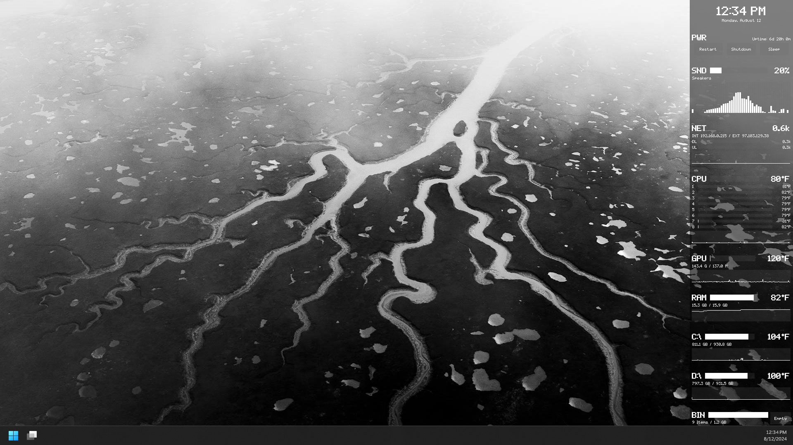
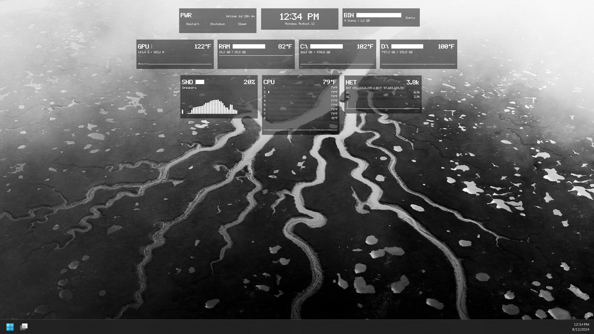
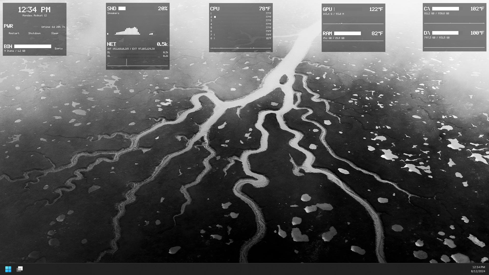

# Minimal Pixel

  

## About

A complete suite of minimalist / pixel skins for [Rainmeter](https://www.rainmeter.net/). The hgh-contrast, monochromatic design keeps stats legible but unobtrusive, and compliments a wide variety of desktop backgrounds. Made following the latest (c. 2024) best practices for optimal performance.

## Installation

- Requires [Rainmeter](https://www.rainmeter.net/) and [SpeedFan](https://www.almico.com/speedfan.php).
- Create a new sub-folder in Rainmeter's `Skins` folder
- [Download the code in the main branch](https://github.com/ben-miles/Minimal-Pixel/archive/refs/heads/main.zip) of this repo, and add it to your new folder
- Open Rainmeter and navigate to the new folder, and enable the skins

## Credits

- Minimal-Pixel uses the font [_PixelMix_](https://www.dafont.com/pixelmix.font), made by [Andrew Tyler](https://andrewtyler.gumroad.com/).
- The photo in the screenshots is [_A black and white photo of a river with a tree in the middle_](https://www.pexels.com/photo/a-black-and-white-photo-of-a-river-with-a-tree-in-the-middle-27585248/), by [Jeremy Bishop](https://www.pexels.com/@jeremy-bishop-1260133/).
